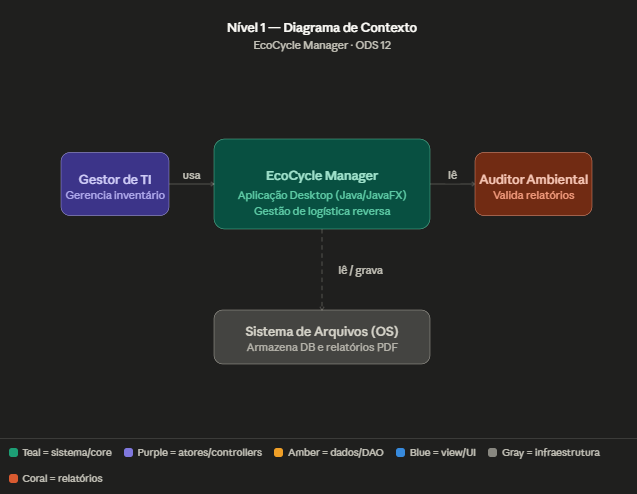
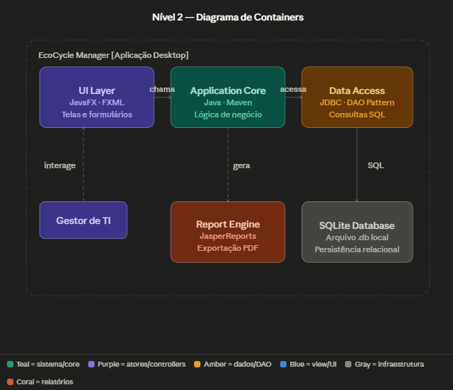
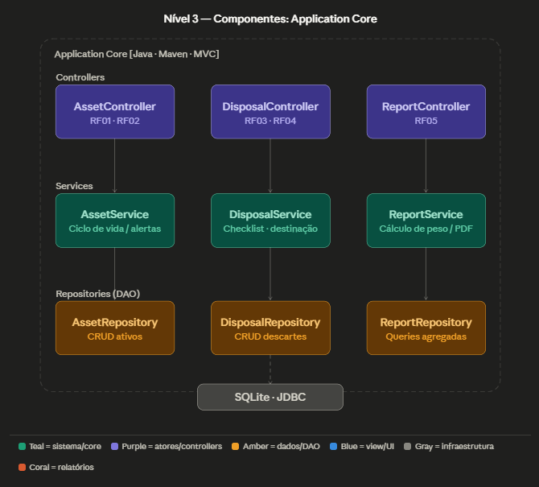
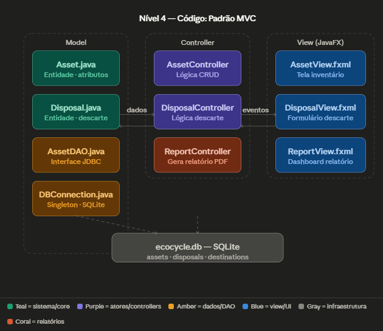

# Arquitetura do Sistema — EcoCycle Manager

> Documentação elaborada conforme o modelo **C4 (Context, Container, Component, Code)**  
> Disciplina: Engenharia de Software · Sprint TP2

---

## 1. Escolhas de Tecnologias

| Camada | Tecnologia | Versão recomendada | Justificativa |
|---|---|---|---|
| Linguagem | Java | 17 LTS | Multiplataforma, tipagem forte, ecossistema maduro para desktop |
| Interface gráfica | JavaFX | 21 | Nativo Java, componentes ricos, suporte a FXML para separar layout de lógica (MVC) |
| Banco de dados | SQLite | 3.x | Arquivo único `.db`, zero configuração de servidor, perfeito para aplicações desktop standalone |
| Driver JDBC | sqlite-jdbc | 3.45+ | Conector oficial SQLite para Java |
| Build e dependências | Apache Maven | 3.9+ | Gerenciamento de dependências, empacotamento em JAR executável |
| Relatórios | JasperReports | 6.x | Geração de relatórios PDF com layout profissional sem servidor externo |
| Padrão arquitetural | MVC | — | Separação de responsabilidades (RNF02), facilita testes e manutenção |

### Justificativa do conjunto tecnológico

A combinação Java + JavaFX + SQLite atende diretamente ao **RNF01** (persistência local em arquivo único) e ao **RNF03** (interface gráfica com componentes visuais). O uso de Maven garante reprodutibilidade do build e facilita a inclusão de dependências como sqlite-jdbc e JasperReports sem configuração manual de classpath.

---

## 2. Projeto Arquitetural — Modelo C4

### 2.1 Nível 1 — Diagrama de Contexto

O sistema possui dois atores e uma dependência de infraestrutura:



| Ator / Sistema | Papel |
|---|---|
| Gestor de TI | Cadastra ativos, monitora ciclo de vida, registra descartes |
| Auditor Ambiental | Consulta e valida os relatórios de sustentabilidade gerados |
| Sistema de Arquivos (OS) | Armazena o arquivo `ecocycle.db` e os PDFs exportados |

---

### 2.2 Nível 2 — Diagrama de Containers

O sistema é composto por quatro containers, todos executando dentro do mesmo processo JVM:




| Container | Tecnologia | Responsabilidade |
|---|---|---|
| UI Layer | JavaFX · FXML | Renderizar telas, capturar eventos do usuário |
| Application Core | Java · Services | Lógica de negócio, validações, orquestração |
| Data Access | JDBC · DAO Pattern | Traduzir objetos Java em queries SQL |
| Report Engine | JasperReports | Consolidar dados e exportar PDF |
| SQLite Database | SQLite 3 | Persistência relacional local |

---

### 2.3 Nível 3 — Diagrama de Componentes (Application Core)

O core está organizado em três camadas horizontais:




| Componente | RF atendido | Responsabilidade |
|---|---|---|
| AssetController | RF01, RF02 | Recebe ações da UI para cadastrar/monitorar ativos |
| DisposalController | RF03, RF04 | Controla o checklist de descarte e registro de destinação |
| ReportController | RF05 | Solicita geração do relatório consolidado |
| AssetService | RF01, RF02 | Calcula prazo de vida útil, emite alertas de vencimento |
| DisposalService | RF03, RF04 | Valida etapas de segurança antes de baixar um ativo |
| ReportService | RF05 | Agrega peso total de material e aciona JasperReports |
| AssetRepository | RF01 | CRUD da tabela `assets` |
| DisposalRepository | RF03, RF04 | CRUD da tabela `disposals` |
| ReportRepository | RF05 | Queries de agregação para relatório |

---

### 2.4 Nível 4 — Código: Padrão MVC



**Estrutura de pacotes sugerida:**

```
src/
└── main/
    └── java/
        └── com/ecocycle/
            ├── model/
            │   ├── Asset.java
            │   ├── Disposal.java
            │   └── Destination.java
            ├── controller/
            │   ├── AssetController.java
            │   ├── DisposalController.java
            │   └── ReportController.java
            ├── service/
            │   ├── AssetService.java
            │   ├── DisposalService.java
            │   └── ReportService.java
            ├── repository/
            │   ├── AssetRepository.java
            │   ├── DisposalRepository.java
            │   └── ReportRepository.java
            └── util/
                └── DBConnection.java   ← Singleton JDBC
    └── resources/
        ├── fxml/
        │   ├── AssetView.fxml
        │   ├── DisposalView.fxml
        │   └── ReportView.fxml
        └── reports/
            └── sustainability_report.jrxml
```

**Schema do banco de dados:**

```sql
CREATE TABLE assets (
    id          TEXT PRIMARY KEY,
    category    TEXT NOT NULL,
    acquired_at DATE NOT NULL,
    lifespan_years INTEGER NOT NULL,
    status      TEXT DEFAULT 'active'   -- active | expiring | disposed
);

CREATE TABLE disposals (
    id              TEXT PRIMARY KEY,
    asset_id        TEXT REFERENCES assets(id),
    disposed_at     DATE NOT NULL,
    disk_sanitized  INTEGER NOT NULL,  -- 0 ou 1
    battery_removed INTEGER NOT NULL,
    destination_id  TEXT REFERENCES destinations(id)
);

CREATE TABLE destinations (
    id   TEXT PRIMARY KEY,
    name TEXT NOT NULL,
    type TEXT                          -- cooperativa | fabricante | reciclador
);
```

---

## 3. Justificativa do Modelo Arquitetural

### Por que MVC?

O padrão **Model-View-Controller** foi escolhido para atender ao **RNF02** e porque:

1. **Separação de responsabilidades** — a lógica de negócio (Service) nunca está acoplada ao código de tela (FXML/Controller JavaFX), o que facilita refatoração e testes unitários isolados.

2. **Compatibilidade nativa com JavaFX** — o framework foi projetado com MVC em mente: arquivos `.fxml` são naturalmente a View, e a anotação `@FXML` conecta automaticamente elementos de UI ao Controller.

3. **Manutenibilidade** — um novo desenvolvedor consegue localizar qualquer funcionalidade apenas pelo nome do pacote, sem precisar ler o código completo.

### Por que aplicação Desktop e não Web?

A escolha por desktop (RNF01) garante:
- **Funcionamento offline** — ambientes administrativos frequentemente têm restrições de rede.
- **Segurança dos dados** — o arquivo `.db` fica na máquina da instituição, sem tráfego de dados sensíveis.
- **Instalação simples** — um JAR executável com as dependências embutidas (fat JAR via Maven Shade Plugin).

### Trade-offs reconhecidos

| Decisão | Vantagem | Desvantagem |
|---|---|---|
| SQLite | Zero configuração, portátil | Não suporta múltiplos usuários simultâneos |
| Desktop (JavaFX) | Offline, seguro | Distribuição de atualizações manual |
| JasperReports | Relatórios profissionais | Curva de aprendizado do `.jrxml` |
