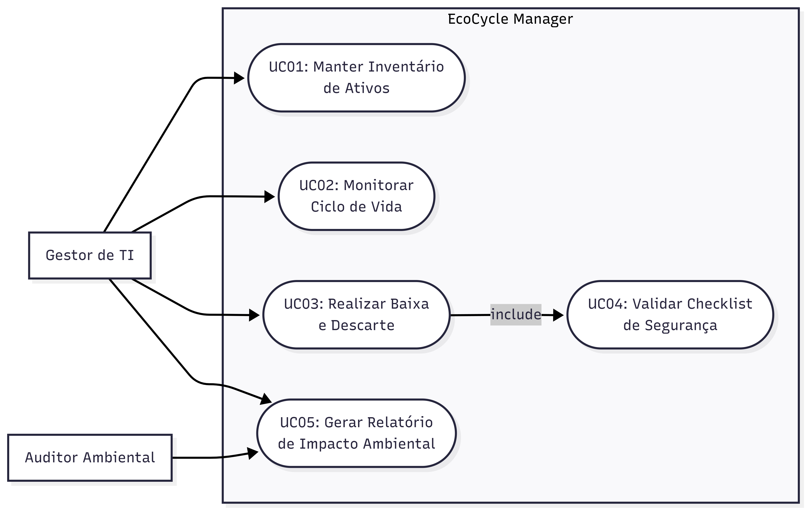

# EcoCycle Manager - Sistema de Gestão de Logística Reversa (ODS 12)

Este repositório contém o desenvolvimento do projeto prático para a disciplina de Engenharia de Software. O foco da aplicação é atender ao **Objetivo de Desenvolvimento Sustentável 12 (Consumo e Produção Responsáveis)**, promovendo a gestão eficiente de resíduos tecnológicos.

---

## 1. Objetivo
O **EcoCycle Manager** tem como objetivo automatizar o controle do ciclo de vida de ativos de hardware em instituições, facilitando a identificação de itens obsoletos e garantindo que o processo de logística reversa e descarte ambientalmente correto seja seguido integralmente.

## 2. O Problema
Muitas organizações sofrem com o acúmulo de "lixo eletrônico" (e-waste) por falta de um inventário que monitore a saúde dos ativos. Isso gera dois problemas principais:
1. **Ambiental:** Descarte incorreto de metais pesados e componentes tóxicos.
2. **Segurança:** Descarte de dispositivos de armazenamento sem o devido processo de sanitização de dados.

## 3. Tipo de Solução
A solução é uma **Aplicação Desktop** desenvolvida com foco em arquitetura modular, utilizando persistência em banco de dados relacional local (**SQLite**). A escolha visa garantir que a ferramenta seja autossuficiente, rápida e de fácil instalação em ambientes administrativos.

---

## 4. Documentação

| Documento | Descrição |
| :--- | :--- |
| [📐 Arquitetura do Sistema](./docs/architecture.md) | Modelo C4 completo (Contexto, Container, Componente e Código), escolhas de tecnologias e justificativas arquiteturais |

---

## 5. Requisitos do Sistema

### 5.1 Requisitos Funcionais (RF)

| ID | Requisito | Descrição | Status |
| :--- | :--- | :--- | :--- |
| **RF01** | Cadastro de Ativos | O sistema deve permitir o registro de itens com ID único, Categoria, Data de Aquisição e Prazo de Vida Útil. | ✅ Implementado |
| **RF02** | Monitoramento de Ciclo | O sistema deve calcular o tempo restante de uso e sinalizar ativos próximos do vencimento técnico. | 🟡 Parcial (cálculo de status) |
| **RF03** | Checklist de Descarte | O sistema deve exigir a confirmação de etapas de segurança (limpeza de disco e remoção de baterias) antes de baixar um item. | ⏳ Backlog |
| **RF04** | Registro de Destinação | Deve ser possível registrar para qual entidade ou cooperativa o resíduo foi enviado. | ⏳ Backlog |
| **RF05** | Relatório de Sustentabilidade | Gerar um relatório consolidado com o peso total de material desviado de aterros comuns. | ⏳ Backlog |

### 5.2 Requisitos Não Funcionais (RNF)

| ID | Requisito | Categoria | Descrição |
| :--- | :--- | :--- | :--- |
| **RNF01** | Persistência Local | Armazenamento | O sistema utiliza SQLite para garantir que os dados sejam salvos localmente em um arquivo único. |
| **RNF02** | Padrão Arquitetural | Estruturação | A aplicação implementa o padrão MVC (Model-View-Controller) para separação de responsabilidades. |
| **RNF03** | Interface Gráfica | Usabilidade | A interface é intuitiva, utilizando JavaFX para facilitar a gestão do inventário. |
| **RNF04** | Performance | Eficiência | O carregamento de listas de ativos é otimizado para não travar a interface durante a busca. |

---

## 6. Diagrama de Caso de Uso

O sistema possui dois perfis principais de interação: o **Gestor de TI**, responsável pela manutenção do inventário, e o **Auditor Ambiental**, que valida os relatórios de descarte.



---

## 7. Stack Tecnológica

| Camada | Tecnologia | Versão |
| :--- | :--- | :--- |
| Linguagem | Java | 17 LTS |
| Interface gráfica | JavaFX | 21 |
| Banco de dados | SQLite | 3.x |
| Driver JDBC | sqlite-jdbc | 3.45+ |
| Build e dependências | Apache Maven | 3.9+ |
| Relatórios | JasperReports | 6.x |
| Padrão arquitetural | MVC | — |

---

## 8. Como Instalar e Executar

### 8.1 Pré-requisitos

Antes de começar, instale as ferramentas abaixo:

#### 1. **JDK 17 (Java Development Kit)**

- **Windows / macOS / Linux:** baixe o [Eclipse Temurin JDK 17](https://adoptium.net/temurin/releases/?version=17) (LTS gratuito).
- Verifique a instalação:
  ```bash
  java -version
  javac -version
  ```
  Saída esperada: `openjdk version "17.x.x"`

#### 2. **Apache Maven 3.9+**

- **Windows:** baixe em [maven.apache.org/download.cgi](https://maven.apache.org/download.cgi), descompacte e adicione `bin/` ao `PATH`.
  - Alternativa via WinGet:
    ```powershell
    winget install Apache.Maven
    ```
- **macOS (Homebrew):**
  ```bash
  brew install maven
  ```
- **Linux (Debian/Ubuntu):**
  ```bash
  sudo apt install maven
  ```
- Verifique:
  ```bash
  mvn -version
  ```

#### 3. **Git** (para clonar o repositório)

- [Download Git](https://git-scm.com/downloads).

> **Observação:** o **SQLite** não precisa ser instalado separadamente. O driver `sqlite-jdbc` já embute o engine e o arquivo `ecocycle.db` é criado automaticamente na primeira execução.

---

### 8.2 Clonar o Repositório

```bash
git clone https://github.com/daniel-felix-dev/EcoCycle-Manager.git
cd EcoCycle-Manager
```

---

### 8.3 Instalar Dependências

O Maven baixa automaticamente todas as dependências declaradas em `pom.xml`:

```bash
mvn clean install
```

Esse comando irá:
- Baixar JavaFX 21, sqlite-jdbc 3.45+, JasperReports 6.x
- Compilar o código-fonte em `src/main/java`
- Executar testes (caso existam)
- Gerar o JAR em `target/`

---

### 8.4 Executar a Aplicação

#### Opção A — Via plugin Maven JavaFX (recomendado em desenvolvimento)

```bash
mvn javafx:run
```

#### Opção B — Via fat JAR (já com dependências embutidas)

```bash
mvn clean package
java -jar target/ecocycle-manager-1.0.0.jar
```

> Na primeira execução, o arquivo `ecocycle.db` será criado no diretório de trabalho com o schema completo (tabelas `assets`, `disposals`, `destinations`).

---

### 8.5 Estrutura do Projeto

```
EcoCycle-Manager/
├── docs/
│   └── architecture.md           ← Modelo C4 e justificativas
├── src/
│   └── main/
│       ├── java/
│       │   ├── module-info.java
│       │   └── com/ecocycle/
│       │       ├── app/          ← MainApp (entry point JavaFX)
│       │       ├── model/        ← Asset, Disposal, Destination
│       │       ├── controller/   ← Controllers JavaFX (@FXML)
│       │       ├── service/      ← Regras de negócio
│       │       ├── repository/   ← DAOs JDBC
│       │       └── util/         ← DBConnection (Singleton)
│       └── resources/
│           ├── fxml/             ← Layouts JavaFX
│           ├── css/              ← Estilos da UI
│           ├── db/               ← schema.sql
│           └── reports/          ← Templates JasperReports
├── pom.xml                       ← Configuração Maven
└── readme.md
```

---

### 8.6 Solução de Problemas

| Problema | Solução |
| :--- | :--- |
| `mvn` não é reconhecido | Verifique se o `bin/` do Maven está no `PATH` e reabra o terminal. |
| `JAVA_HOME` não definido | Configure a variável apontando para o diretório do JDK 17 (ex.: `C:\Program Files\Eclipse Adoptium\jdk-17`). |
| `ClassNotFoundException: javafx.application.Application` | Use `mvn javafx:run` (o plugin configura o module-path automaticamente). |
| Tela em branco ao abrir | Confirme que `src/main/resources/fxml/AssetView.fxml` está no classpath após `mvn clean install`. |
| Erro ao gravar `ecocycle.db` | Execute em diretório com permissão de escrita; o arquivo é criado na pasta atual. |

---

## 9. Planejamento de Projeto

O acompanhamento das tarefas é realizado através do **GitHub Projects**, organizado da seguinte forma:

* **Project Backlog:** Contém todos os Requisitos Funcionais listados acima.
* **TODO (Sprint TP2):** Atividades focadas no Projeto de Software e Arquitetura (C4 Model).
* **Doing:** Atividades em desenvolvimento na sprint atual.
* **Done:** Atividades validadas e concluídas.

🔗 [Acessar o GitHub Project](https://github.com/users/daniel-felix-dev/projects/1)
